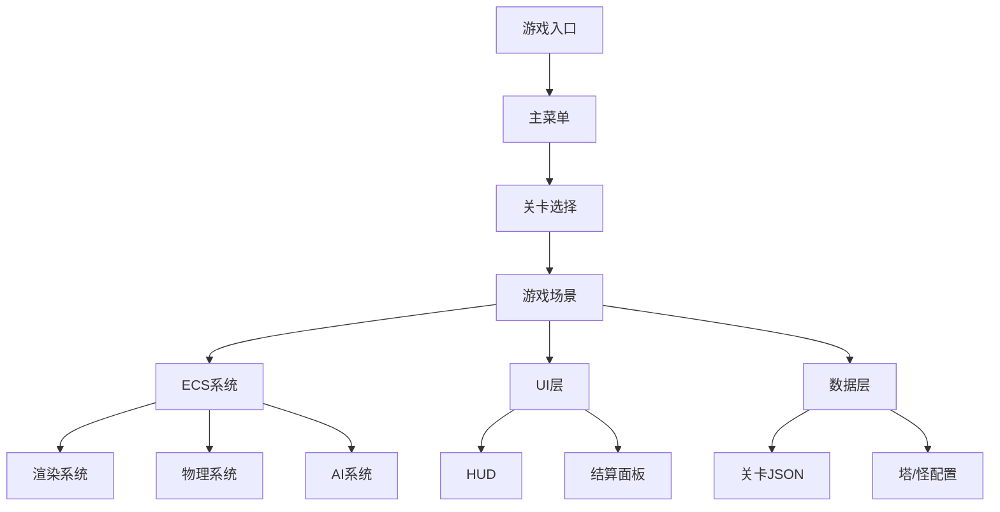

# 塔防游戏项目计划

## 项目概述
基于用户提供的提示词模板，实现一款原创网页版塔防游戏。风格接近保卫萝卜但使用原创素材，避免侵权。支持移动端/PC自适应，PWA离线，60FPS稳定，包含完整游戏循环、新手引导和数值成长。

## 技术栈选择
- **默认方案A**: TypeScript + Phaser 3 (Canvas/WebGL自动优选) + Vite + ESLint/Prettier + Vitest/Jest + Playwright (E2E) + Workbox (PWA)
- 构建工具: Vite
- 测试: Vitest/Jest (单元) + Playwright (E2E)
- PWA: Workbox

## 项目结构
```
/src
  /app (入口、路由、PWA注册)
  /game
    /core (游戏循环、时间步、ECS/Scene、对象池、空间索引)
    /entities (Tower/Monster/Projectile/Effects/Tile)
    /components (Position/Render/Collider/Health/Attack/AI/Targeting/Buff/Cost)
    /systems (Render/Physics/Targeting/Attack/Damage/Spawn/Wave/Pathfinding/Effect/Audio)
    /data (关卡JSON、怪物/塔配置、掉落表、数值曲线)
  /ui (HUD、主菜单、关卡选择、暂停、结算、商店、引导)
  /assets (texture atlas、sprites、音效、音乐、字体)
/tests (unit + e2e)
```

## 核心玩法设计
### 基本规则
- 地图: 预设路径(Waypoints) + 阻挡格(Grid)
- 怪物沿路径前进，抵达基地扣生命值
- 货币: 金币，用于建塔升级
- 控制: 暂停、倍速(1x/2x/3x)、手动/自动开波
- 胜负: 基地生命为0或完成所有波次

### 塔类型 (至少6种)
1. 单体高伤: 单发、高射程、低攻速
2. 溅射AOE: 中射程、中攻速、小范围爆炸
3. 减速持续: 低伤高控，附加减速/DoT
4. 穿透直线: 直线激光、对齐路径强势
5. 连锁弹跳: 同层怪物连锁最多N次，衰减
6. 多重箭: 分裂或散射，近中程清杂

### 怪物类型 (至少6类)
1. 普通: 平衡血量/速度
2. 快速: 低血高移速
3. 重甲: 高血高抗性
4. 飞行: 无视部分地面阻挡，走空中路径
5. 护盾: 先破盾再掉血
6. Boss: 极高血量，技能(召唤/瞬移/免疫)

### 伤害系统
- 类型: 物理、魔法、真实
- 抗性: 按类型减免或百分比减伤
- 升级: 费用几何递增，伤害/攻速/射程线性或次幂提升

## 架构设计
### 游戏循环
- 固定时间步 (1/60秒)
- 渲染与逻辑解耦
- 暂停/倍速通过时间缩放
- 掉帧补步，设最大限制

### ECS系统
- Components: Position、Velocity、Sprite/Animation、Collider、Health、Attack、Targeting、Buff/Status、PathFollower、GoldValue、Selectable、AudioCue
- Systems: Spawn、Pathfinding/PathFollow、Targeting、Attack/Projectile、Damage/Death、Buff、Economy、Wave、UI/HUD、Audio、SaveLoad

### 优化
- 空间索引: 栅格或四叉树
- 对象池: 复用Projectile/Effects
- 渲染: 纹理合图，批次渲染减少draw calls

## 数据结构
### 关卡JSON
```json
{
  "id": "level1",
  "name": "第一关",
  "waypoints": [{"x":0,"y":0}, {"x":100,"y":0}],
  "spawnPoints": [{"x":0,"y":0}],
  "base": {"x":200,"y":0,"lives":20},
  "waves": [
    {
      "spawn": [{"type":"normal","count":5,"interval":1000}],
      "modifiers": {"speedMul":1.0,"hpMul":1.0,"resist":{"phys":0,"magic":0}},
      "reward": 100
    }
  ],
  "towersAllowed": ["single","aoe"],
  "initialGold": 100,
  "missionGoals": {"noLeak":true,"timeLimit":300000}
}
```

### 塔配置JSON
```json
{
  "id": "single",
  "name": "单体塔",
  "damageType": "phys",
  "baseDamage": 10,
  "attackRate": 1.0,
  "range": 100,
  "projectile": {"speed":200,"splashRadius":0,"chainCount":0},
  "effects": [],
  "upgradePath": [
    {"cost":50,"deltaDamage":5,"deltaRate":0.1,"deltaRange":10}
  ]
}
```

## UI/UX设计
- 主界面: 开始游戏、设置、图鉴、成就、商店
- 关卡选择: 章节面板、星级展示、解锁条件
- 游戏HUD: 金币/生命/波次/倍速/暂停/设置/重开，建塔栏、塔信息卡、技能按钮
- 结算: 胜利/失败、统计、奖励、重试/下一关
- 新手引导: 前三关分步遮罩提示

## 美术与音频
- 风格: 清新Q萌、色块分明、高对比度
- 资源: 原创图形与音效，使用占位素材
- 打包: 纹理图集(atlas)，音频分SFX/BGM

## 性能目标
- 60FPS稳定
- 主线程16ms内
- 内存峰值控制，无抖动
- 低端机降画质自适应

## 里程碑计划
### M1 原型 (2周)
- 项目骨架、基础渲染
- 地图与寻路
- 建塔与射击
- 单关可通关

### M2 完整循环 (3周)
- 6塔6怪实现
- 3关+新手引导
- HUD/商店/结算
- 数值曲线与存档

### M3 扩展与优化 (2周)
- 15关、无尽模式
- PWA离线
- 性能调优
- 自动化测试
- 分析与配置签名

### M4 上线与运维 (1周)
- 打包、CDN缓存
- GitHub Pages部署：设置GitHub Actions自动构建和部署
- 灰度与回滚：通过分支管理
- 文档与演示

## 验收标准
- 移动端/PC三关新手流程60FPS稳定
- 暂停/倍速/开波/存档功能可用
- 至少6塔6怪配置完备
- 3章×5关可通关，无尽≥10分钟无性能恶化
- PWA离线启动并游玩首章
- 单元测试≥70%覆盖，E2E通过新手三关
- 无明显内存泄漏

## Mermaid架构图


## 风险与缓解
- 性能瓶颈: 提前实现对象池和空间索引
- 复杂数据管理: 使用JSON配置驱动
- 移动端适配: 优先考虑触控优化
- PWA缓存: 实现渐进式缓存策略

## 后续迭代
- 飞行怪独立路径
- 激光塔过热机制
- 无尽模式Boss动态调整
- 后端排行服务集成